# Dokumentasi Pengujian Sistem Pelaporan

## A. Skenario Positif (Positive Test Cases)

Menguji seluruh alur utama web saat pengguna (User maupun Admin) menggunakan sistem sesuai dengan prosedur yang benar.

| ID Test Case | Modul | Skenario Pengujian | Hasil yang Diharapkan | Gambar Bukti |
| :--- | :--- | :--- | :--- | :--- |
| TC-WEB-POS-01 | Autentikasi | Login sebagai User (Mahasiswa/Dosen) | Sesi dibuat, masuk ke Dashboard User. | ![Bukti TC-POS-01]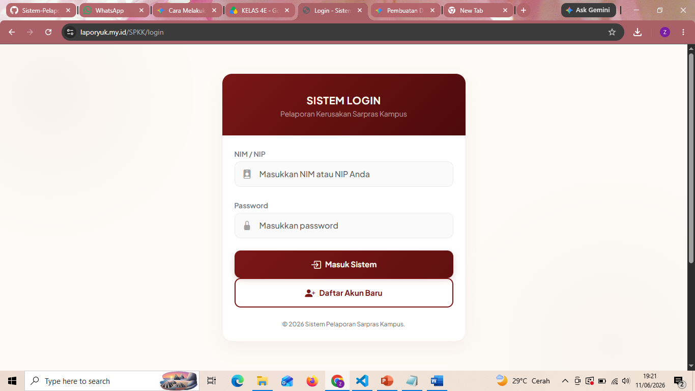 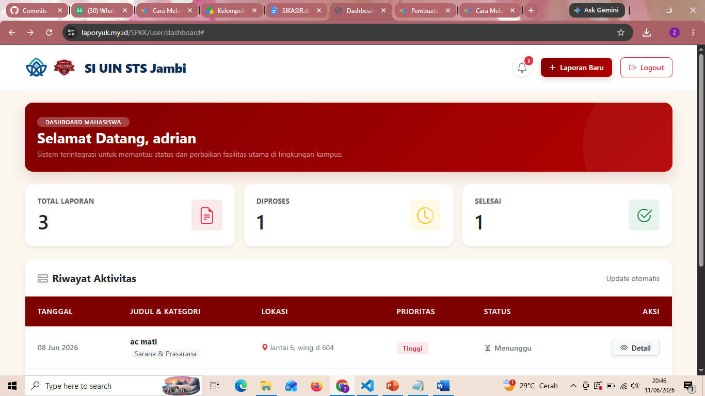 |
| TC-WEB-POS-02 | Pelaporan | Mengirim laporan kerusakan | Laporan tersimpan, status Pending. | 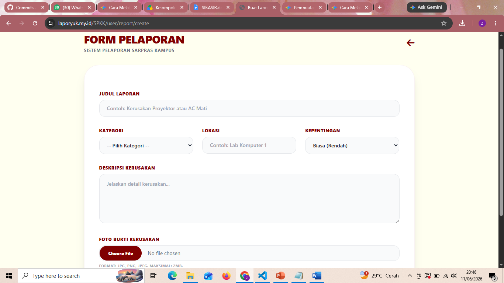 |
| TC-WEB-POS-03 | Tracking | Memantau riwayat & status | Menampilkan laporan dengan status sesuai. | 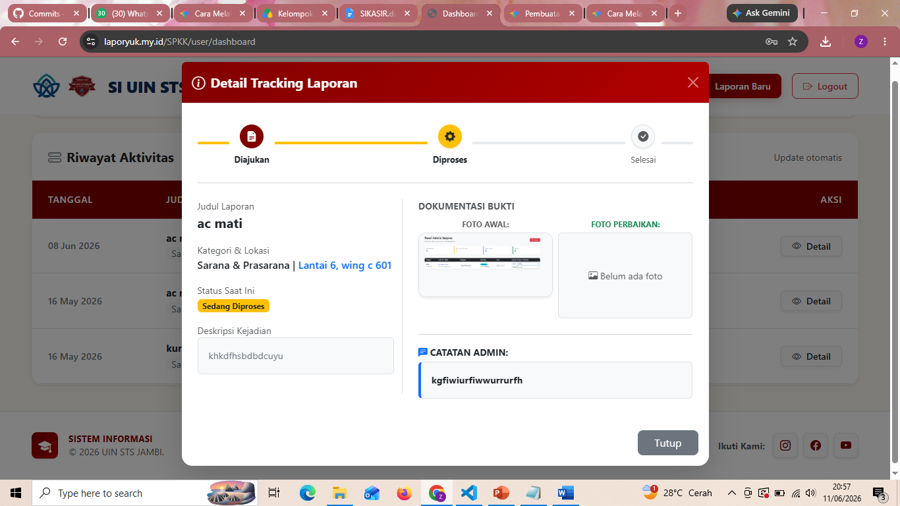 |
| TC-WEB-POS-04 | Admin | Verifikasi dan atur prioritas | Status & prioritas ter-update di database. | 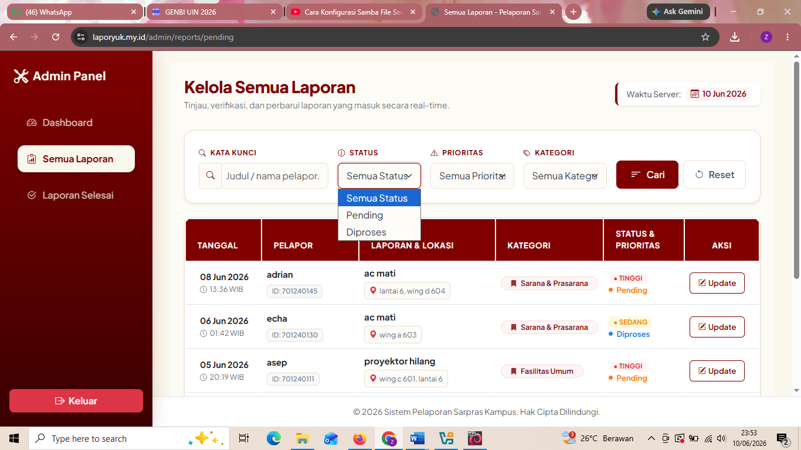 |
| TC-WEB-POS-05 | Admin | Penyelesaian penanganan laporan | Status Selesai, user melihat perubahan. | 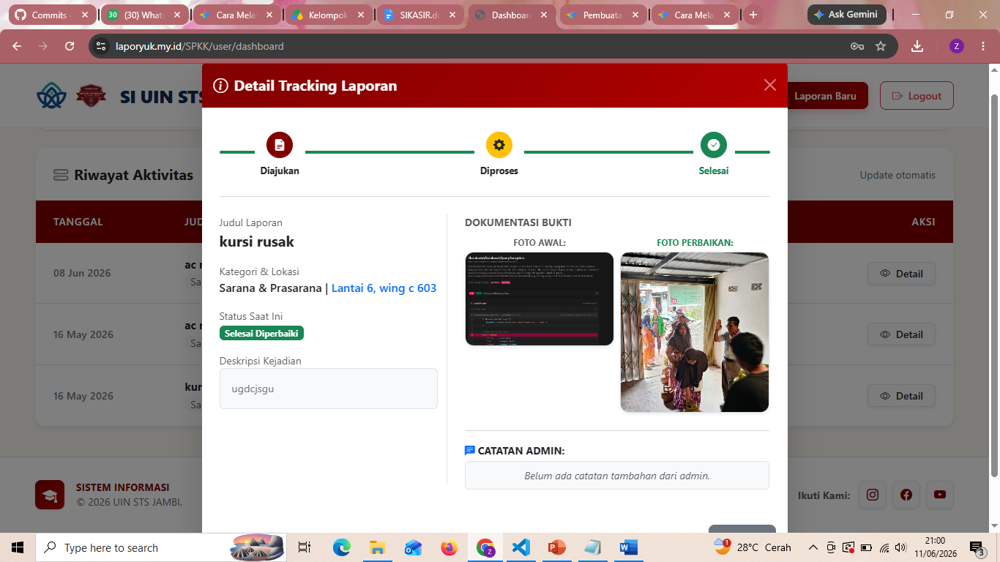 |
| TC-WEB-POS-06 | Autentikasi | Logout sistem dengan aman | Sesi aktif dihapus, kembali ke Login. | 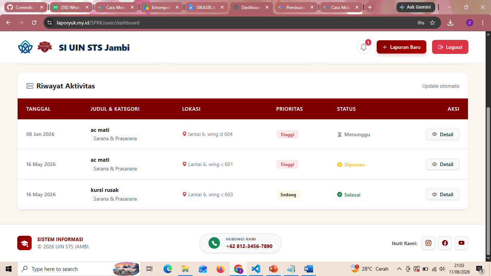 |

---

## B. Skenario Negatif (Negative Test Cases)
Menguji keamanan dan validasi untuk memastikan sistem tidak *crash* atau diretas saat menerima input yang dilarang.

| ID Test Case | Modul | Skenario Pengujian | Hasil yang Diharapkan | Gambar Bukti |
| :--- | :--- | :--- | :--- | :--- |
| TC-WEB-NEG-01 | Keamanan | Bypass URL halaman Admin | Sistem memblokir & redirect ke Login. |  |
| TC-WEB-NEG-02 | Autentikasi | Login dengan kredensial salah | Tampil pesan "Login Gagal". | 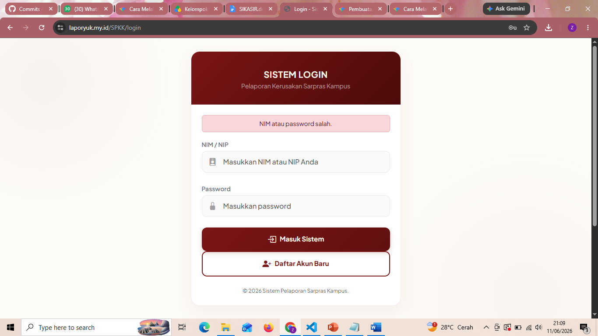 |
| TC-WEB-NEG-03 | Pelaporan | Submit form dengan data kosong | Sistem menahan form, muncul peringatan. | 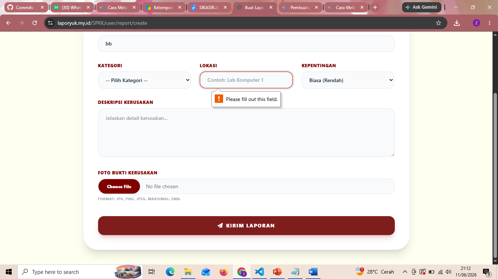 |
| TC-WEB-NEG-04 | Pelaporan | Upload file ekstensi berbahaya | Validasi gagal mengunggah file selain jpg/png. kembali ke form |  |
| TC-WEB-NEG-05 | Admin | Penolakan laporan | Harus Mengisi keterangan penolakan. | 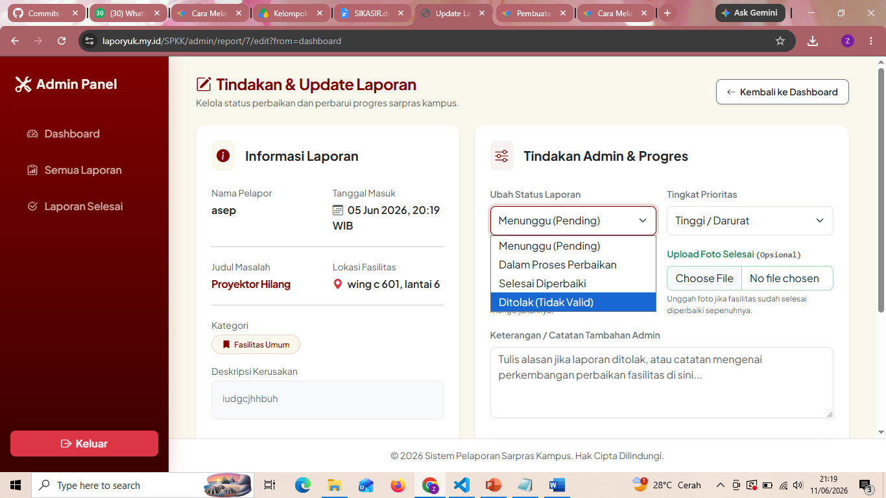 |
| TC-WEB-NEG-06 | Keamanan | Uji kerentanan XSS | Script disimpan sebagai teks biasa. | 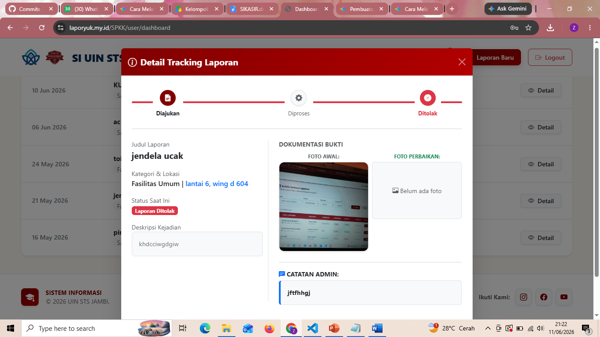 |

---

## C. Skenario Edge (Boundary Test Cases)
Pengujian nilai batas untuk memastikan tidak ada *bug* pada limit parameter sistem.

| ID Test Case | Modul | Skenario Pengujian | Hasil yang Diharapkan | Gambar Bukti |
| :--- | :--- | :--- | :--- | :--- |

| TC-WEB-EDG-01 | Pelaporan | Batas minimal deskripsi (50 char) | Lolos validasi & berhasil dikirim. | 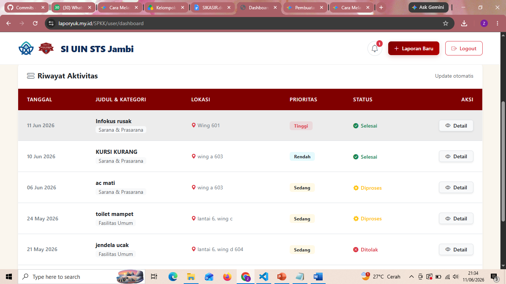 |
| TC-WEB-EDG-02 | Pelaporan | Kurang dari batas minimal (49 char) | Sistem menolak pengiriman kembali ke form pelaporan kosong. |  |
| TC-WEB-EDG-03 | Pelaporan | Batas maksimal ukuran foto (2 MB) | Upload sukses (response < 5 detik). |  |
| TC-WEB-EDG-04 | Pelaporan | Melebihi batas maksimal (2,1 MB) | Sistem menolak pengiriman kembali ke form pelaporan kosong. |  |
| TC-WEB-EDG-05 | Autentikasi | Batas kadaluarsa sesi (30m 1s) | Sesi expired ke halaman Leanding page. | 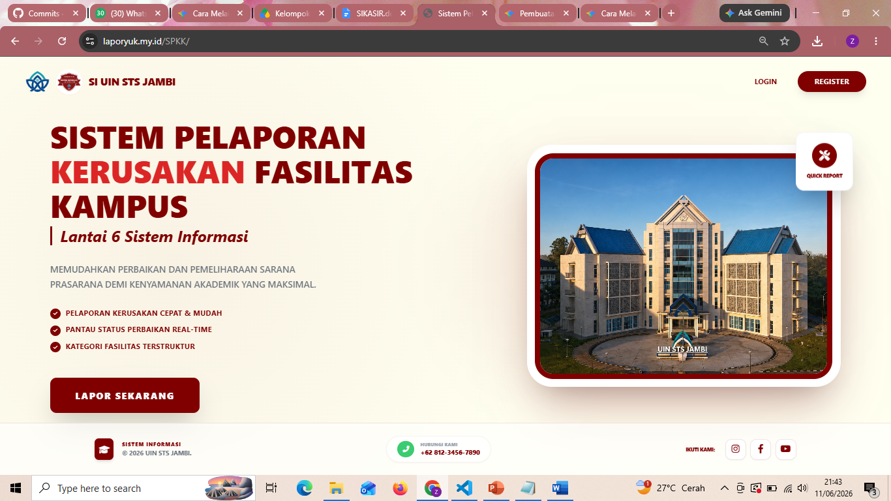 |
| TC-WEB-EDG-06 | Pelaporan | Batas maksimal Judul (255 char) | Data tersimpan, teks tidak terpotong. | 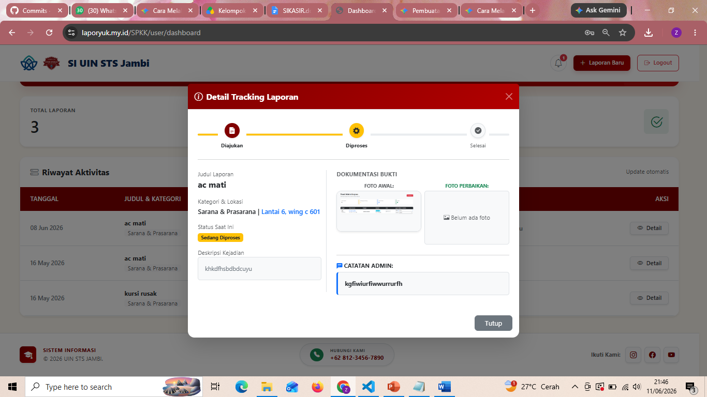 |
=======

